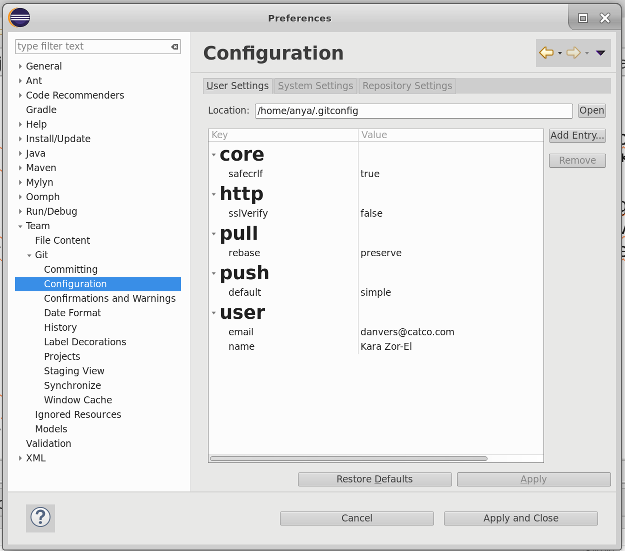
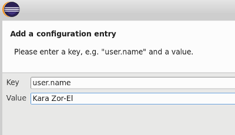
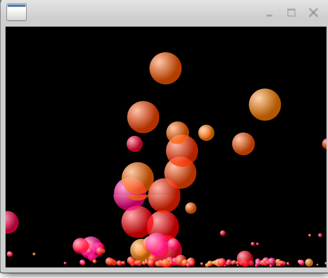
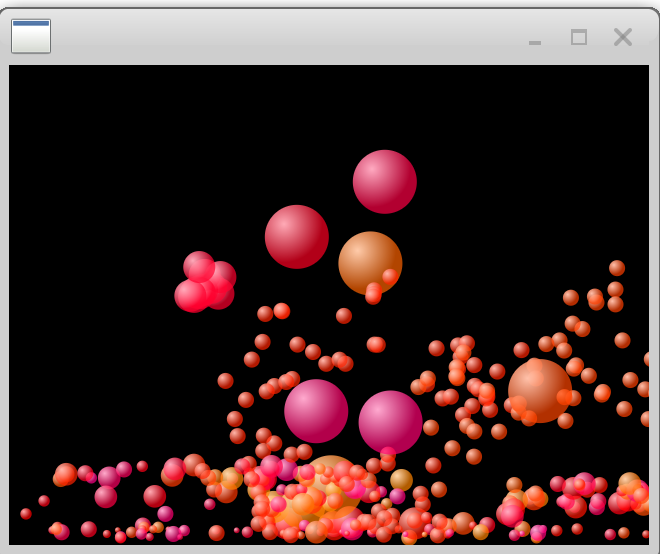
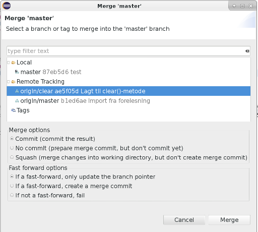
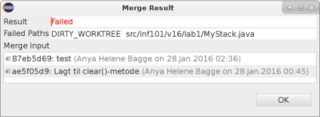
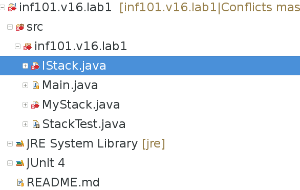
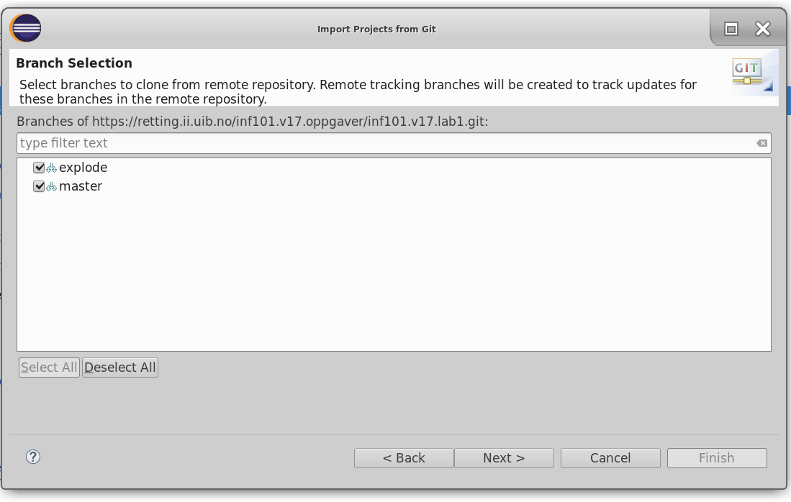

# Inf101 Lab 1

## Obligatoriske aktiviteter

* På denne oppgaven vil vi at du gjør deloppgave 3 og 4 (pluss nok av deloppgave 0–2 til at du har noen endringer å committe i deloppgave 3) så fort som mulig og før **1. februar**. 

(Dette er fordi vi vil se hvem som faktisk har tenkt å delta i undervisningen, og være sikre på at alle får til å hente ut oppgavene og bruke innleveringssystemet, slik at vi kan fikse eventuelle problemer så raskt som mulig. Husk å spørre om hjelp om du blir stående fast eller får rare problemer!)


## Læringsmål

* Bli kjent med GitLab og retting.ii.uib.no
* Bli kjent med integrert utviklingsverktøy
* Klone, committe og pushe med Git
* Enkel bruk av branching og merging
* Håndtere en merge-konflikt
* Bruke JUnit-tester

I denne oppgaven har vi laget til et git repositorium basert på stabel-eksempelet fra forelesningen i forrige uke. Du har fått din egen private kopi av dette repositoriet på GitLab, og skal laste ned, redigere og laste opp kode.

Laboppgavene har ingen egen tidsfrist, men vi regner med at du gjør minst 80% av dem (og helst alle) før du tar eksamen. Du kan regne med at du får bruk for det du lærer i denne oppgaven i løpet av semester og på eksamen (og forhåpentligvis også senere i livet).

## Oppgave 0: Installasjon / Oppsett

Pass på at du allerede har gjort ferdig:

* [Installasjon av Java 8 og Eclipse](https://retting.ii.uib.no/inf101/inf101.v18/wikis/oppsett) – *viktig:* hvis du ikke gjør https-innstillingen (setter `http.sslVerify` til `false`) er det mulig du vil ikke komme videre i oppgaven

I tillegg, hvis du ikke bruker Eclipse, eller om du vil trene på å bruke git direkte og ikke gjennom Eclipse, må du ha [installert Git](http://git-scm.com/book/en/v2/Getting-Started-Installing-Git).

* Om du ikke alt har gjort det, må du aktivere din GitLab-bruker. Klikk på "Sign In" øverst til høyre her på siden eller på [retting.ii.uib.no](https://retting.ii.uib.no/), og velg så *Forgot your password?*. Som epostadresse fyller du inn brukernavnet ditt (abc123) *eller* brukernavn+`@student.uib.no` *eller* UiB epostadressen din (som regel fornavn`.`etternavn`@student.uib.no`) – det er litt forskjellig hva hver enkelt av dere er satt opp med (det skal være samme epost du er registrert med i Mitt UiB). Du skal så få en epost med en link hvor du kan sette et passord for GitLab. Pass på at du bruker et annet passord enn du bruker ellers på UiB / andre steder.

### Oppgave 0.1: Profilbilde

* Både Mitt UiB og GitLab lar deg sette et profilbilde. I tillegg til at det er (litt) gøy, er det også ganske praktisk å kunne knytte navn til ansikter.
* Du kan sette profilbildet på en av to måter:
    * Klikk på bildet på profilen din (på https://mitt.uib.no/profile og https://retting.ii.uib.no/profile), og last opp et bilde. (Mitt UiB lar deg også ta bildet direkte på maskien din.)
    * Eller du kan registrere epostadressen din og et profilbilde hos [Gravatar](http://en.gravatar.com/) – da vil profilbildet dukke opp alle steder du bruker den aktuelle epostadressen. (Det er den epostadressen som er satt som “standard” på Mitt UiB det er snakk om her – sannsynligvis fornavn`.`etternavn`@student.uib.no`. Du kan se hvilken epostadresse som er i bruk på [retting.ii.uib.no/profile](https://retting.ii.uib.no/profile) og [mitt.uib.no/profile/settings](https://mitt.uib.no/profile/settings).

(Om du ikke setter profilbildet selv, får du en rar geometrisk figur på GitLab og en grå person med påfallende lite hår på Mitt UiB.)

### Oppgave 0.2: Git oppsett

Du bør også settte opp Git på maskinen din slik at den kjenner til navnet og epostadressen din (dette er separat fra at GitLab kjenner navnet og epostadressen) – denne informasjonen brukes til å identifisere deg hver gang du committer endringer (Git er veldig nøye på at den som har skrevet koden får navnet sitt korrekt knyttet til den).

* I Eclipse kan du gjøre dette med *Preferences → Team → Git → Configuration*. Under *User Settings* skal du legge til `user.name` og `user.email` med *Add Entry* (om ikke det allerede er satt opp riktig.)

* Du kan også gjøre det fra kommandolinjen med:
```
git config --global user.name "Daisy Johnson"
git config --global user.email "quake@shield.gov"
```

(Begge deler skriver konfigurasjonen til samme sted, så det holder å gjøre det et av stedene.)





## Oppgave 1: Kloning

Du finner oppgavekoden i repositoriet med URIen:

      https://retting.ii.uib.no/<brukernavn>/inf101.v18.lab1.git

Hvor `<brukernavn>` skal byttes ut med brukernavnet ditt på UiB. Merk at
det er nødvendig å bruke https (ssh vil ikke fungere).

Som vist i forelesningene, for å få dette prosjektet inn i eclipse, velg
`import` fra fil menyen.  Velg så `Git` -> `Projects from git` -> `Clone URI`.
Fyll in URIen som du finner over. (Eclipse fyller så ut *host* og *repository path* med `retting.ii.uib.no` og
`/<brukernavn>/inf101.v18.lab1.git`.

Skriv inn ditt brukernavnet og GitLab-passord, og trykk `next`. Nå velger du hvilken
branch du skal ha (`master` og `explode`). Trykk på `next`. Neste ting er å velge en mappe å
putte repositoriet i  under `Directory` (standard er `git`-mappen i hjemmeområdet ditt), og la resten være slik det er (initial
branch: `master`, Remote name: `origin`), `next` -> `import existing project`
-> `next` -> `finish`.

Nå skal du ha et prosjekt i eclipse som heter `inf101.v18.lab1`.

**VIKTIG:** *oppgaven er avhengig av at du har Java 8 med JavaFX installert (følger med i Oracle JDK, men er separat pakke (OpenJFX) hvis man bruker OpenJDK (f.eks. på Linux)), ellers vil du få kompileringsfeil. Antakelig har du dette fra før, hvis ikke se [instruksjon om oppsett](https://retting.ii.uib.no/inf101/inf101.v18/wikis/oppsett).*

## Oppgave 2: Implementering
*(Om du ikke gjør ferdig / får til denne, kan du likevel gå videre til Oppgave 3)*

### 2.1: Kjør test

* Aller først kan du prøve å kjøre testen som er lagt ved, og se at den feiler. Høyreklikk på `BallTest` i Project Explorer, og velg *Run as → JUnit test*

    * Vi bruker [JUnit](http://junit.org/junit5/docs/current/user-guide/) som testrammeverk, slik at vi kan lage automatiserte tester for alt vi gjør. Testingen gjør at vi lettere kan være trygge på at ting fungerer som det skal – *og* være rimelig trygge på vi kan oppdage om eventueår lle endringer vi gjør senere har uforutsette konsekvenser.
    * Det går an å teste manuelt også, f.eks. ved å gjøre programmet og se at det ser ut til å funke som det skal – men mennesker er ofte enten for ivrige, late eller umotiverte til å gjøre grundig testing. 

### 2.2: Implementere ferdig Ball

* Lag ferdig feltvariablene i klassen og fyll inn metodene.
* Stedene som skal fylles inn er merket med *TODO* (du kan se en oversikt over disse i *Tasks*-tabben i nedre halvdel av Eclipse-skjermen – evt. *Window → Show View → Tasks* om denne mangler)
* Du trenger feltvariabler for x og y koordinater (posisjon), og delta-x / delta-y (endring i position per tidsenhet). `double` passer som type for disse.
* Les dokumentasjonen for hver enkelt metode for å se hvordan du skal implementere den.

*Tips 0:* Du trenger ikke ha løst alt i denne oppgaven før du prøver å kjøre testene igjen (2.3) eller prøver å kjøre `BallDemo` (2.4). Det er ofte lurt å prøve ting tidlig og ofte! 

*Tips 1:* I step()-metoden oppdaterer du x,y ved å legge til deltaX,deltaY. I accelerate()-metoden legger du argumentene til deltaX,deltaY. I hit metoden kan du flytte ballen et lite steg tilbake ved å legge bounceX,bounceY til x,y posisjonen. Dersom en av (eller begge) bounce-argumentene er forskjellig fra 0, må du negere den tilsvarende delta-verdien, slik at ballen begynner å gå i motsatt retning.

*Ønsket funksjonalitet:* ballene skal bevege seg i henhold til nåværende hastighet, bli påvirket av aksellerasjon (tyngdekraft – kommer fra `step()`-metoden i `BallDemo`), og "sprette" når de treffer noe.

### 2.3: Kjør test igjen

* Høyreklikk på `BallTest`, velg *Run as → JUnit test*. Hvis du har implementert Ball riktig, skal testresultatet nå være grønt og ikke rødt.

* (Merk at foreløpig er BallTest veldig enkel, så det er kanskje en del mulige feil i Ball som den ikke vil være i stand til å finne – vi skal lage bedre tester senere.)

### 2.4: Kjør demo

* Høyreklikk på `BallDemo`, velg *Run as → Java application*. La deg fascinere av effekten.



## Oppgave 3: Committe endringene

* Høyreklikk på prosjektet i Project Explorer, velg *Team → Commit...*
   * Det finnes to utgaver av commit-dialogen. Den som kommer om som standard nå for tiden er "Git Staging View", som kommer som en tab nede på skjermen. Alternativt kan man bruke "Commit Changes"-dialogen som er litt enklere i bruk.
    * For å sette opp så du bruker "Commit Changes"-dialogen: Åpne *Preferences* (på Window eller Eclipse menyen),  finn *Team → Git → Commiting*, og fjern krysset på "Use Staging View instead of Commit Dialog". Trykk Apply og OK.
    * For å bruke "Commit Changes": fyll inn en melding, sjekk at filene du har endret er markert under, og trykk "Commit".
    * For å bruke "Staging View": dra filene du har endret fra "Unstaged Changes" til "Staged Changes". Fyll inn en melding, og trykk "Commit"
* Skriv inne en passende commit-melding (f.eks. "implementert Ball"), sjekk listen over filer (antakelig er det bare Ball.java som er endret) og trykk "Commit".
* Du har nå lagret endringene dine på din egen maskin.
* Høyreklikk på prosjektet og velg *Team → Show in History*. Du skal nå kunne se endringen du gjorde, med meldingen du la inn. Den vil være merket med *master* (grenen du er på) og *HEAD* (betyr at dette er den nyeste versjonen). Du vil også kunne se en tidligere versjon som er merket med *origin/master* – dette er den versjonen som du lastet ned i deloppgave 1.

## Oppgave 4: Pushe til GitLab / retting.ii.uib.no

* Høyreklikk på prosjektet i Project Explorer, velg *Team → Push to Upstream*
* Du må kanskje fylle inn brukernavn og passord
* Du vil få opp en kvitteringsside med en liste over endringene som ble sendt til GitLab. *Sjekk denne for å se om noe har gått galt!* Hvis du får en feilmelding bør du spørre om hjelp.
* Hvis du ser på prosjektet ditt på GitLab siden, vil du kunne se listen over endringer. URLen til ditt eget prosjekt er `https://retting.ii.uib.no/<brukernavn>/inf101.v18.lab1/commits/master`

### Oppgave 4.1: Se testresultater

* Gå til [https://retting.ii.uib.no:81/me](https://retting.ii.uib.no:81/me) (første gang du gjør dette må du si ja takk til autentisering)
* Du vil se en oversikt over oppgaven dine:
   * De som er grønne har blitt testet og alle testene er OK
   * De som er røde har blitt testet og noen av testene feilet
   * De som er gule har du ikke gjort noe med foreløpig
* Hvis du har tatt INF101 eller INF102 tidligere, vil du se dine gamle oppgaver her også
* Klikk på oppgavenavnet for å få mer info om testene. Her kan du f.eks. se hvilke tester som feilet (merket i rødt). Du kan trykke på "Logg" for å se loggen fra kompilering og testkjøring – her er det mye tekst, så du må bla nedover for å finne ut hva som evt. har skjedd.
* For testene som har feilet, kan du klikke på testnavnet for å se feilmeldingen for akkurat den testen.

## Oppgave 5: Fyrverkeri

*(Om du ikke gjør ferdig / får til denne, kan du likevel gå videre til Oppgave 6)*

Vi skal nå endre programmet slik at ballene "eksploderer" etter en viss tid, og blir til mange mindre baller. Hver ball skal selv styre når den eksploderer. 

* I BallDemo finner du noen metoder du kan bruke for å lage eksplosjonen. Det letteste er å gjøre `demo.addExplosion(this)`, som vil fjerne den nåværende ballen, og erstatte den med ti mindre baller som har litt endret retning. Alternativt kan du bruke en kombinasjon av `addBall` og `removeBall`.
* Du må styre når eksplosjonen skal skje. En enkel løsning er å bruke feltvariabelen `steps` som du øker for hvert steg. Når denne når f.eks. 50 eller 100, iverksetter du eksplosjonen. 
* Commit og push det du har gjort på samme måte som over

(Merk at vi foreløpig ikke har noen god måte å automatisk teste at eksplosjonen skjer. Dette skal vi finne ut av senere i semesteret.)



## Oppgave 6: Legge til en ny fil

* Velg *File → New → Java Class*. Pass på at *Package* er satt til `inf101.v18.objects`.
* Kall klassen `Oppgave6`.
* Trykk *Finish*.
* Legg merke til det lille spørsmålstegnet ved siden av filen i Project Explorer – det betyr at Git ikke kjenner til filen.
* Velg *Team → Commit* – du vil nå se at den nye klassefilen dukker opp blant filene, med et lite spørsmålstegn ved siden av. Det betyr at den så langt er ukjent for Git. 
    * Hvis du er i *Git Staging*: Dra den nye filen fra *Unstaged Changes* til *Staged Changes*.
    * Hvis du er i *Commit* dialogvinduet: Huk av i boksen ved siden av, og klassefilen vil bli lagt til i endringen du committer.
* Skriv en liten commit-melding, og velg *Commit and Push*
* Sjekk GitLab-websiden, og se at den nye filen er med (`https://retting.ii.uib.no/<brukernavn>/inf101.v18.lab1/tree/master/src/inf101/v17/objects`)

## Oppgave 7: Rot med merge

Vi skal nå prøve å hente inn mer kode som er laget på forhånd, og som antakeligvis vil være i konflikt med det du har laget. Anya har nemlig også lagt til kode for eksploderende baller. Koden for dette ligger på en egen gren som heter `origin/explode`. Vi skal nå flette (*merge*) disse endringene med endringene du har gjort – og antakeligvis vil det resultere i trøbbel.

* Først, pass på at du har committet og pushet alt du har gjort.
* Så, høyreklikk på prosjektet, og velg *Team → Merge...*
* I vinduet som kommer opp, velger du "origin/explode" under "Remote Tracking" (se screenshot under; merk at det er andre navn på bildet) *(Tilsvarende git-kommando er `git merge origin/explode`)*  (Hvis 'origin/explode' mangler, se *Tips om Branches* nederst på siden.)



* Trykk *Merge*
* Du vil så få opp et vindu med resultatet.
    * Om du får *Result: Failed*, så har du antakelig gjort ting som du ikke har committet ennå. Commit og prøv igjen.

    

    * Om du får *Result: Conflicts*, så er det som forventet, og du må følge instruksene videre.
    * Om du ikke får feil, har du antakelig ikke gjort deloppgave 5, eller du har gjort den helt likt til det Anya har gjort. Du kan i såfall ta helg.
* For å sortere ut konfliktene, må du fikse filene som er markert med rødt. Hver av disse vil typisk inneholde linjer fra forskjellige versjoner av koden. For eksempel:

```
<<<<<<< HEAD
=======
	/**
	 * Number of calls to step() method
	 */
>>>>>>> origin/explode
	void clear();
```
Det som er mellom `<<<<<<<` og `========` er koden du har laget (i dette tilfellet ingenting – her har man altså glemt å legge til dokumentasjon), og det som er mellom `=======` og `>>>>>>>` er koden vi prøvde å flette inn. Vanligvis bør du slette den ene og beholde den andre – som regel vil du beholde det du har laget selv.
* Ordne konfliktene slik at koden virker og testene er grønne.
* For hver av filene som hadde konflikt (merket med rødt i utforskeren), velg *Team → Add to Index*. Du forteller da Git at du har ordnet opp i konflikten.



* Gjør så en commit (typisk med en melding som "Merged branch origin/explode"). Hvis du har utestående konflikter vil du få beskjed om å fikse de først (husk *Add to Index* for å si at alt er i orden).
* Push.

*Konflikter dukker normalt opp når flere jobber på samme prosjektet. 'Flere' kan i dette tilfellet bety deg selv på forskjellige maskiner. Det er generelt litt trøblete å håndtere, også for erfarne utviklere. Alle konflikter må være håndtert før man kan committe nye endringer.* 

* http://weblog.masukomi.org/2008/07/12/handling-and-avoiding-conflicts-in-git/
* http://wiki.eclipse.org/EGit/User_Guide#Resolving_a_merge_conflict

# Generelt – Innlevering av laboppgaver

Innlevering skal skje til GitLab. For å levere
bruker du `Team` -> `Commit...`, og så `Commit and Push`. *Husk* at hvis du har opprettet nye klasser/filer, må du krysse av for disse i commit-dialogen for at de skal bli med i opplastingen.

Vi anbefaler at du gjør commit hver dag, eller hver gang du er ferdig med en større endring. Da går det alltid an å lete seg tilbake i historien til en tidligere versjon hvis du har havnet på villspor (commit-dialogen inneholder også en praktisk "Commit and push"-knapp, som pusher endringene til GitLab med en gang).

# Tips om Branches

* [Les mer om branching her](https://git-scm.com/book/en/v2/Git-Branching-Branching-Workflows)

Proffe utviklere gjør gjerne utviklingen sin på grener – *branches*. For hver nye ting man skal lage, så oppretter man først en ny gren, så gjør man utviklingen, og så integrerer man det man har gjort med hovedgrenen (*merge* med *master*-grenen). Dette gjør at man kan jobbe med hver nye endring/feature/bugfix isolert fra andre endringer (og eventuelt også andre utviklere, om man jobber på et felles prosjekt). Dette er særlig aktuelt med større endringer som går over lang tid, men en del utviklere bruker også branching som del av den daglige arbeidsflyten for selv små endringer.

I denne oppgaven brukte vi grener for å fremprovosere en konflikt når grenene skulle flettes sammen igjen. Det er en veldig aktuell problemstilling; men samme problemet kan også oppstå når flere jobber på samme gren og f.eks. endrer på samme klasse eller metode. Det er i såfall sistemann som pusher som blir sittende med jobben med å sortere ut konfliktene, slik du måtte gjøre over.

Det kan forekomme at du ikke har fått med deg alle grenene når du importerte repositoriet. Du vil da ikke finne 'origin/explode' på listen over grener. Du kan i såfall hente den igjen ved å kjøre *Team → Pull* eller *Team → Fetch from Upstream*. Dette kan skje f.eks. hvis du valgte å bare hente 'master'-grenen i deloppgave 1 når du fikk opp dette vinduet:




