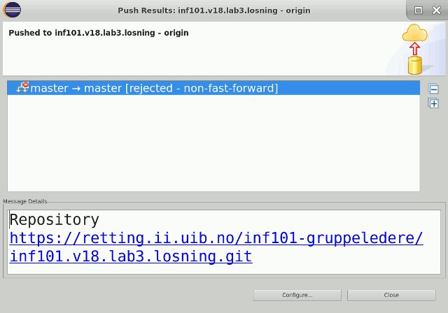

# Lab 3 Part I

[Lab Overview](LAB-3.md)

## Part I: Git
### 1.0. More Git Background
Git is a [distributed version control system](https://en.wikipedia.org/wiki/Distributed_version_control):
* A [version control system](https://en.wikipedia.org/wiki/Version_control) stores all previously committed changes to a project. (This lets you undo mistakes, maintain multiple versions of the same piece of software at the same time, and easily track the history of changes when you're trying to find out why something went wrong.)
* Modern version control systems are collaborative, and let multiple people work independently on their own copy of the files, before the changes are integrated / synchronised. Since all the changes are recorded in the history it's easy for the version control system to see what each developer has done, and merge changes from multiple developers more or less automatically. Typically, this synchronisation happens when a developer *pulls* from or *pushes* to the server (sometimes called *update* and *check in*). (In [really](https://en.wikipedia.org/wiki/Source_Code_Control_System) [old](https://en.wikipedia.org/wiki/Revision_Control_System) systems, there was little or no support for multiple developers, and you might be required to *lock* the files you were editing, so that no one else could modify them at the same time. If you then went on vacation without unlocking, your co-workers would be very upset.)
* A *distributed* version control system like Git also supports decentralised collaboration: there isn't really a central server that everyone synchronises with – instead each developer has a complete *clone* of the entire project, and developers can exchange their commits peer-to-peer, without any server. For practical reasons (e.g., backups and easier interaction), we typically want a server anyway and this is the role of our GitLab-installation at https://retting.ii.uib.no/. Your local clone of your INF101 labs are just as good and complete as those on the server, but the server also does backups, lets your teachers look at and help you with your code, has a nice web interface and does automatic integration testing whenever you push to it.

Collaboration and distribution has two consequences that we will deal with now:
* Someone else can have made changes while you were working, and these changes must be integrated with yours. (Step 1.1 below, and [Lab 1, oppg. 7](https://retting.ii.uib.no/inf101.v18.oppgaver/inf101.v18.lab1/blob/master/README.md#oppgave-7-rot-med-merge).)
* We change change what we consider to be the “server” (upstream) or even have multiple ones. (Step 1.3 below.)

### 1.1. Always *pull* before *push* *(todo!)*
As seen in [Lab 1, oppg 4](https://retting.ii.uib.no/inf101.v18.oppgaver/inf101.v18.lab1/blob/master/README.md#oppgave-4-pushe-til-gitlab-rettingiiuibno) you should check the response you get whenever you *push*, because it can actually go wrong.

If you see the message *rejected – non-fast-forward*, someone else has made and pushed changes before you. This could be someone yourself, if you're using multiple computers or if you've made multiple copies of your Git files on your computer – but in real life it's often another developer on the same project (less likely for INF101 students, but sometimes Anya or someone else will push to your repository on retting.ii.uib.no.).

So, if you go and make some changes to your *Lab 2* solution, then select *Team → Commit...*, fill in the commit form or staging view form and hit *Commit and Push*...


...you should see a message like this (but with a different repository name, of course):



* **Go and do this now**, with your `inf101.v18.lab2` project. If you don't have any changes to commit or push, just do a tiny change to any of your java files (insert an extra line, for example).

* You get the *rejected* message because the server's copy has changes that you haven't seen (mainly just a few corrections in the exercise text). It's your responsibility to integrate those changes from the server into your local repository (this is called *merging*), before you can push the combined changes back to the server.

* First, right-click on your Lab 2 project, and select *Team → Pull* from the menu. You should get an OK message similar to the one below (possibly after entering your password again):


* The list will include all the changes that have been integrated into your project. In your case it should be the top three commits from the [Lab 2 commits log](https://retting.ii.uib.no/inf101.v18.oppgaver/inf101.v18.lab2/commits/master).

* If the message says *Failed*, some of our changes are in conflict with some of your changes (unlikely unless you've changed the text of the README.md file). You'll have to resolve this as seen in [Lab 1](https://retting.ii.uib.no/inf101.v18.oppgaver/inf101.v18.lab1/blob/master/README.md#oppgave-7-rot-med-merge).

If you're working on the command line, the message will look like this:
```
To https://retting.ii.uib.no/anya/inf101.v18.lab2.git
 ! [rejected]        master -> master (fetch first)
error: failed to push some refs to 'https://retting.ii.uib.no/anya/inf101.v18.lab2.git'
hint: Updates were rejected because the remote contains work that you do
hint: not have locally. This is usually caused by another repository pushing
hint: to the same ref. You may want to first integrate the remote changes
hint: (e.g., 'git pull ...') before pushing again.
hint: See the 'Note about fast-forwards' in 'git push --help' for details.
```
and it's solved by running `git pull`, and then `git push` again.

**General rule:** when you're working with Git, you will normally have to do *pull* before you can do *push*. So, your sequence of steps should be:
* *Commit* your work (remember to include all relevant files and a nice commit message).
* *Pull* to see if anyone else has made any changes.
* *Push* to send the changes to the server.

If you're mostly working alone (as in INF101), you can normally skip the *pull* step, and then just do it if your push is rejected (this will fix 95% of push problems; ask for help with the rest).

### 1.2. Checking status of edits and commits
If you're wondering if all your changes have been committed and pushed, you can see this in the Eclipse package explorer.


Here, “↑1” indicates that you have made one commit that hasn't been pushed yet. You may also have “↓N” (much less likely), which means that you have fetched N commits from the server, but those haven't been merged yet.

A “>” indicates that a file has been edited but not committed yet (or that a folder (transitively) contains such a file):


 
If you have added a file (made a new class, for instance), it will have a small question mark in the corner of its icon:


You should add such files to Git, either with *Team → Add to index...* or in the commit dialog – except if it's an irrelevant file for some reason (not really part of the project, or it's generated automatically), in which case you should do *Team → Ignore* on it. As you see on `SeedsAutomaton.java`, files that are in Git have a little yellow cylinder in the corner of their icon.

On the command line, you can get the same information with `git status`.

### 1.3. Merge Requests and Forks
#### Background
A very common situation in [online collaborative software development](https://en.wikipedia.org/wiki/Open-source_software_development) is doing minor (or even major) work on a project that isn't owned by you and where you might not be (or want to be) an official part of the development team. For instance, if you're contributing a bugfix or have implemented an extra feature for an open source project (this can be both a good way to learn, and a good way to develop your CV). You might also be working on a project that has a slightly more formalised workflow, where changes should be reviewed by the other developers before they are accepted into the project. This is the sort of situation distributed version control systems like Git are made for – Git in particular was created for the development of the [Linux kernel](https://en.wikipedia.org/wiki/Linux_kernel), which has more than 12000 contributors and a somewhat decentralised [development process](https://en.wikipedia.org/wiki/Linux_kernel#Development).

The [workflow](https://retting.ii.uib.no/help/workflow/forking_workflow.md) is as follows (you don't have to do any of this now; most of the relevant bits have been done automatically):
* You want to contribute to a project, and create a fork of the project ([retting.ii.uib.no](https://retting.ii.uib.no) supports this for projects hosted here; but all the major open hosting services like [GitHub.com](https://github.com), [GitLab.com](https://gitlab.com) and [BitBucket.org](https://bitbucket.org) all support forking). This is your own personal copy of the project which you can develop and edit without interfering with other developers. This is also how all your INF101 exercises are set up – they are forks of the main exercise repository, so students don't interfere with each other.
* You continue development until you have changes you want integrated into the *upstream* (the project you forked from).
* You use the hosting service ([GitLab at retting.ii.uib.no](https://retting.ii.uib.no) in our case) to send a *merge request* (also called a *pull request*) to the upstream. The system will look at all changes you have done, and all changes done to the main repository (the “upstream”), and try and see if they still fit together (if they don't, you may have to manually merge them, otherwise Git will merge automatically). The merge request is handled a bit like a bug report; the upstream developers will be alerted and can discuss the requests in the comment section – perhaps asking you questions or tell you to fix stuff they don't like.
* If your merge request is accepted, the upstream developers will *merge* it into the upstream project, and your changes will become part of the upstream repository (i.e., the commits you made to your repository will also be part of the history of the upstream repository). 
* You might now delete your fork, if you don't intend to do further development, or you may want to merge the upstream (if they had other changes) back into your own fork and continue working on it.  
  
#### Our Situation
[Part II](LAB-3_II_ANT.md) of this exercise (the Java programming bits) is based on the same cellular automata framework used in [Lab 2](https://retting.ii.uib.no/inf101.v18.oppgaver/inf101.v18.lab2/blob/master/README.md), with a few changes. Also, you will (hopefully) have done some changes to your own fork of Lab 2, such as fixing the `MyGrid` implementation. If you haven't, you should do so now – otherwise you won't be able to finish Lab 3.

This situation is similar to the fork/merge workflow commonly used with Git: there's an upstream (the originally handed-out Lab 2 code from `/inf101.v18.oppgaver/inf101.v18.lab2`), which has been changed (into the Lab 3 hand-out from `/inf101.v18.oppgaver/inf101.v18.lab3`) – while you have been modifying your fork of Lab 2 (fixing `MyGrid` and implementing Brian's Brain). Before you can start implementing Lab 3, you must *merge* your Lab 2 solution (`/USERNAME/inf101.v18.lab2`) into your Lab 3 code (`/USERNAME/inf101.v18.lab3`) – both of them are based on the same original upstream repository, so you can handle this by sending yourself a *merge request*. (It's not exactly the same situation as above, since you're not actually merging with the upstream, but only with another fork of the upstream – but the technique is the same, and very useful in a collaborative setting.) 

#### Your Task *(todo!)*

(See below for step-by-step screenshots.)

* First – finish [Lab 2](https://retting.ii.uib.no/inf101.v18.oppgaver/inf101.v18.lab2/blob/master/README.md). You'll need at least a correctly working `MyGrid`.

* Commit and push your Lab 2 solution (see also step 1.2 of this Lab).

* Go to the project page for *Lab 2* at `https://retting.ii.uib.no/USERNAME/inf101.v18.lab2` (*not* the Lab 3 page). Check that your commits appear on the *Commits* sub-page.

* On the overview page, click *(+) Create New... → New merge request*

* Select *USERNAME/inf101.v18.lab2* and *master* as the source branch and *USERNAME/inf101.v18.lab3* and *master* as the target branch, and click *Compare branches and continue*.

* Pick a title for your merge request (or use the default); you can also write a description if you'd like (you should do this in real life, but in this case you're the only one who would read it). Click *Submit merge request*.

* On the next page, you can review the merge request. If everything is OK, there will be a green checkmark, and a *Merge* button. Press it to complete the merge (or explore the interface a bit further, and have a little online discussion with yourself first).

* If everything went well, you are now done with Part I, and can proceed to [Part II – Langton's Ant](LAB-3_II_ANT.md).

* You might also get a merge conflict. This should only happen if you've modified the exercise text, `CellState.java` or something else we didn't expect you to change. If so, you can read the [GitLab documentation on merge requests](https://retting.ii.uib.no/help/user/project/merge_requests/index.md) and [how to resolve conflicts in the GitLab UI](https://retting.ii.uib.no/help/user/project/merge_requests/resolve_conflicts.md). **If you get stuck, ask for help!**

* If everything goes horribly wrong, you can also manually copy your Lab 2 files to Lab 3 (in particular, `MyGrid.java`). 

## Screenshots

### Step 1: Start

### Step 2: Pick projects and branches

### Step 3: Submit

### Step 4: Merge

### Step 5 (done!)


## Part II: Langton's Ant

[Go to Part II](LAB-3_II_ANT.md)
