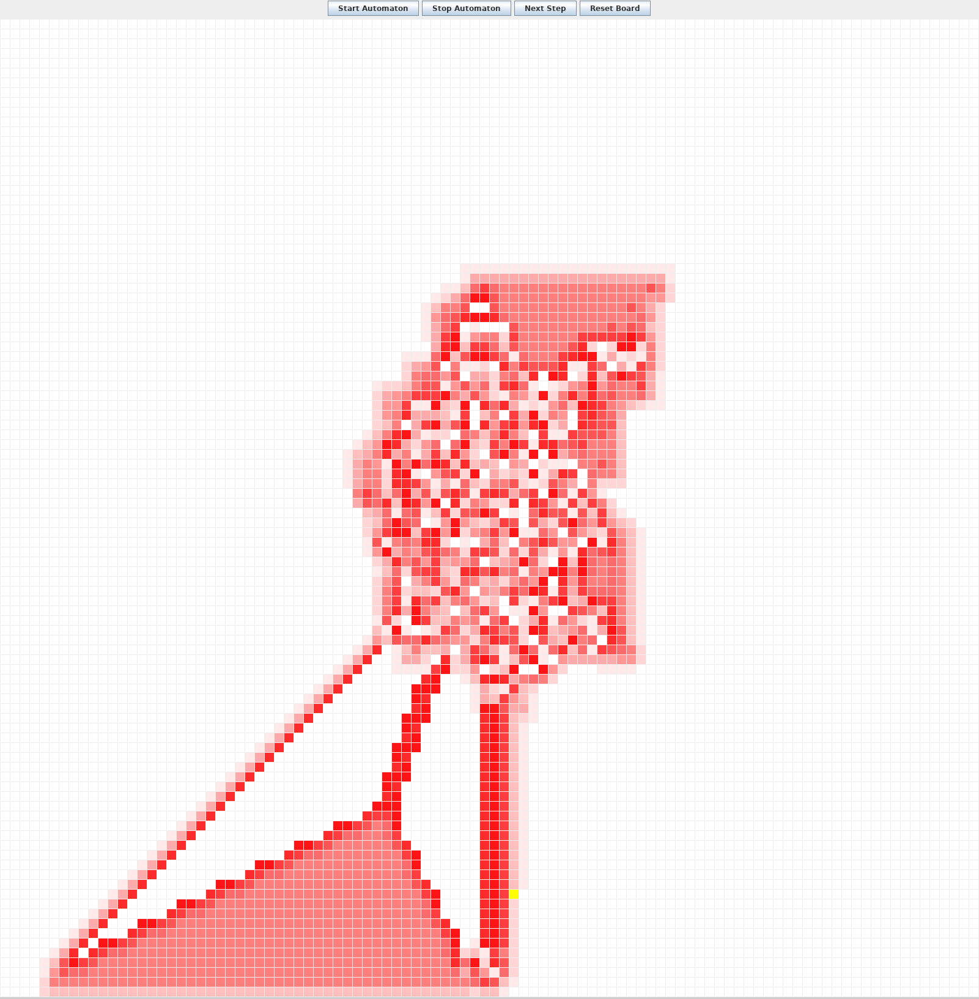
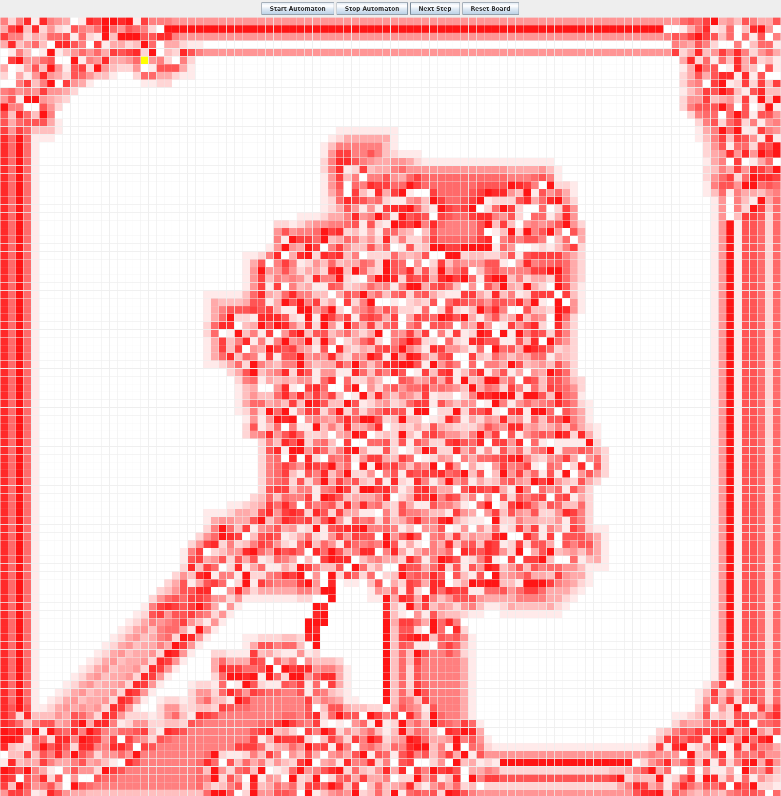
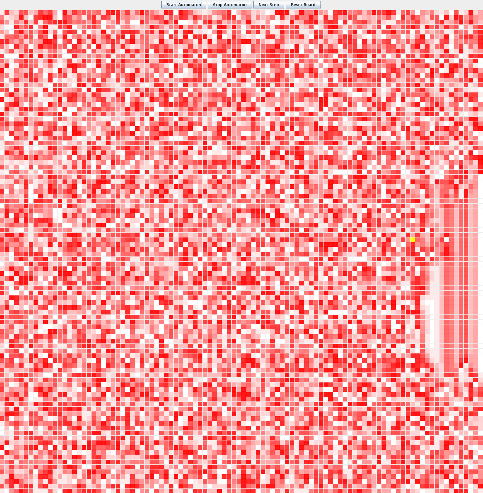

# Lab 3 Part II

[Lab Overview](LAB-3.md)

# Part I: Git

[Go to Part I](LAB-3_I_GIT.md)

# Part II: Langton's Ant
**You must complete [Part I](LAB-3_I_GIT.md) before doing this part!**

This week's Lab-exercise deals with another type of cellular automata, [Langton's Ant](https://en.wikipedia.org/wiki/Langton's_ant). This automaton was conceptualized in 1986 by Chris Langton and proven to be [Turing-complete](https://en.wikipedia.org/wiki/Universal_Turing_machine) 2000. In other words, any algorithm can be simulated by Langton's Ant.

The idea of the automaton is simple: An ant moves across the grid formed by the cells of the automaton and each cell has one of *n* states (or colors). The automaton is equipped with a set of rules, telling for each color *i* = 1,...,*n* whether the ant should turn left or right when stepping on a cell with color *i*. After the ant left the cell, the color is shifted in a cyclic fashion, i.e. a cell with color *i* is set to color (*i*+1) mod *n*.

The standard Langton's Ant has two states, say black and white and the following rules:

- White: Turn right.
- Black: Turn left.

An example execution of a few steps looks like this: 

<p><a href="https://commons.wikimedia.org/wiki/File:LangtonsAntAnimated.gif#/media/File:LangtonsAntAnimated.gif"></a><br>By <a href="//commons.wikimedia.org/wiki/User:Krwawobrody" title="User:Krwawobrody">Krwawobrody</a> - <span class="int-own-work" lang="en">Own work</span>, Public Domain, <a href="https://commons.wikimedia.org/w/index.php?curid=2041023">Link</a></p>

The goal of this exercise is to implement a generalisation of Langton's Ant to an (arbitrary) number of colors. In particular, a rule for a Langton's Ant can be encoded as a string of L's and R's in the following way. As an example, the rule 'LLRRRL' means that the ant should move left when encountering color 1, 2 or 6 and right when encountering color 3, 4 or 5.

## 2.0
If you have successfully completed [Part I](LAB-3_I_GIT.md), you should find your Lab 3 project at
```
https://retting.ii.uib.no/USERNAME/inf101.v18.lab3.git
```

* Clone it / import it into Eclipse (or your preferred IDE)
* See previous labs or [Hvordan hente og levere oppgaver](https://retting.ii.uib.no/inf101/inf101.v18/wikis/hente-levere-oppgaver) for help

## 2.1 Overview of the code
The code in this exercise is based on the code of Lab 2 with the following changes/additions.

- *Cellstate* is not an `enum` anymore but a class with a single integer value, indicating the color of the cell. The constants ALIVE, DYING and DEAD are there to ensure that the code of the old exercises still works.

- *Direction* is an `enum` holding the values `NORTH`, `EAST`, `SOUTH`, `WEST` which is used to determine the direction the ant is facing in the grid.

- *Ant* is a class that captures the position in integer (x, y) coordinates as well as the direction it is facing.

- *LangtonsAnt* is a stub of a class that contains most of the logic. As before, it implements the *ICellAutomaton* interface and all logic should be implemented in the corresponding methods.

## 2.2 Complete the ant *(todo!)*
In the *Ant* class, the implementations of the *turnLeft()* and *turnRight()* methods are missing. This should be done as follows. Consider *turnLeft()* (*turnRight()* works symmetrically) and suppose the ant is in position (x, y) and faces NORTH. Then a left turn means

- Decreasing the ant's *x*-value by 1.
- Making the ant face *WEST*.

Analogous rules have to be devised for the other cases and implemented accordingly.

## 2.3 Complete the implementation of LangtonsAnt
Throughout the following, when referring to *color i*, we mean a *CellState* object with value i.

### 2.3.1 Check the input rule
The *LangtonsAnt* class contains a method to verify whether a given input rule is valid or not. A rule (given as a string) is invalid if one of the following holds.

- The length of the string exceeds the value of the constant `MAX_RULE_LENGTH`.

- The string contains characters other than 'L' and 'R'.

### 2.3.2 Implement *initializeGeneration()* *(todo!)*
Initialize the first generation of the automaton by doing the following.

- Give all fields color 0.

- Initialize an ant that sits in the middle of the grid, facing NORTH.

- Initialize the *seenState* field to color 0.

### 2.3.3 Implement *stepAutomaton()* *(todo!)*
In the automaton's step method, the ant moves according to the previously read color (stored in the field *seenState*) and shifts the color of the field it is leaving. 

Note that a new *Ant* object *nextAnt* has been initialized and that everything that concerns the future position of the ant in the grid have to be executed on that object.

The following things need to be done.

- Fill in the calls of *turnLeft()* and *turnRight()* in the corresponding cases.

- Check if the calculated position is a valid one (i.e. the ant is not thrown off the grid) and if not, reset the position in a way of your choosing.

- Update the color (/state) of the field the ant is *leaving* (note that this concerns the value of the *ant* field, not the *nextAnt* variable). The next color should be `(seenState.getValue() + 1) % rule.length`

- Update the *seenState* field, i.e. get the color of the next cell the ant is moving to and store it.

- Move the ant to the new position in the grid, using the *nextAnt* field.

- Update the *ant* field variable by setting it to *nextAnt*

### 2.3.4 Have fun! *(todo!)*
Replace the *ICellAutomaton* object *ca* in the *Main* with a *LangtonsAnt* object with a rule of your choosing and watch the ant draw patterns.

* If you'd like it do run faster, you can modify `inf101.v18.cell.gui.CellAutomataGUI`. Line 72 makes the automaton do one step every 1/20 second: `timer = new javax.swing.Timer(1000/20, this);` – you can set the timer delay to, e.g., `1000/60`, or `10` (ten milliseconds).

## 2.4 Have more fun! *(todo!)*

There's a lot of other things you can do with cellular automata, including further extensions of Langton's Ant.

* [Turmites](https://en.wikipedia.org/wiki/Turmite) extend the ant with state, and should be possible to implement with a modification to the `Ant` class.
* There's also [Langton's Loops](https://en.wikipedia.org/wiki/Langton%27s_loops)
* [Paterson's worms](https://en.wikipedia.org/wiki/Paterson%27s_worms) is another automaton, but uses a triangular grid (doesn't work so well with our framework).
* There are standard rules for [Elementry cellular automata](https://en.wikipedia.org/wiki/Elementary_cellular_automaton), including the one seen on the sea snail shell in Lab 2. See the [WikiPedia page on Cellular Automata](https://en.wikipedia.org/wiki/Cellular_automaton) for more inspiration.
* You can also try to simulate simple physical phenomena, such as fire spreading or snow fall. For example:
  * A snow flake (an `ALIVE` cell) will move one step down per iteration if the cell below is free (e.g., if the cell below is `DEAD`, it becomes `ALIVE` and the current cell becomes `DEAD`). For this case, the order in which you process the grid in `stepAutomaton()` becomes important (you should start at the bottom and go up).
  * A fire would need multiple states; e.g., `WATER`, `WOOD`, `IGNITING`, `BURNING`, `BURNT` and then rules to move between them.
  * Even simple liquid flow can be simulated with automata or something close to it (e.g., use the CellState with integers to keep track of the amount of water in each square, and build rules around pressure and momentum) – though it can require a bit of physics and math.


## Sample output
Multi-color Langton's Ant pattern `"RRLLLRLLLRRR"`. [See more examples at WikiPedia.](https://en.wikipedia.org/wiki/Langton's_ant#Extension_to_multiple_ants) 


&nbsp;

&nbsp;

